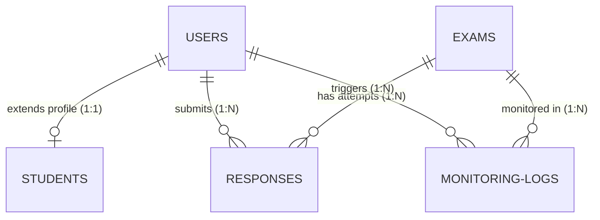

# MongoDB Database Schemas

This document details the database schema configuration and design definitions for the **Smart Proctoring System for Online Exams (SPSOE)**.

All models are implemented using **Mongoose ORM** inside `/server/models/`.

---

## Collections Summary

### 1. Users Collection
Stores credentials, roles, and dates.
*   **Path**: `/server/models/User.js`
*   **Fields**:
    *   `_id` (ObjectId): MongoDB primary key.
    *   `name` (String, required): Student or Administrator full name.
    *   `email` (String, unique, lowercase, required): Registration email.
    *   `password` (String, hashed, required): Hashed password using bcrypt.
    *   `role` (String, enum: `student`, `admin`): Identity role.
    *   `createdAt` (Date): Creation timestamp.

### 2. Students Collection
Enriches the User profile with student details and face descriptors.
*   **Path**: `/server/models/Student.js`
*   **Fields**:
    *   `_id` (ObjectId): MongoDB primary key.
    *   `user` (ObjectId, ref: 'User', unique): User relationship link.
    *   `studentId` (String, unique, required): University student identification number.
    *   `profileImage` (String, required): Base64 encoded JPEG profile photo captured during signup.
    *   `faceEmbedding` (Array of Numbers): 128 elements array containing the facial feature vectors.

### 3. Exams Collection
Defines individual exam guidelines and question pools.
*   **Path**: `/server/models/Exam.js`
*   **Fields**:
    *   `_id` (ObjectId): MongoDB primary key.
    *   `title` (String, required): Title of the exam.
    *   `description` (String): Instructions summary.
    *   `duration` (Number, required): Allowed duration in minutes.
    *   `questions` (Array of sub-documents):
        *   `questionId` (String): Unique identifier.
        *   `type` (String, enum: `mcq`, `descriptive`): Question type.
        *   `text` (String): Question body.
        *   `options` (Array of Strings): Choices (MCQ only).
        *   `correctAnswer` (String): Answer choices (MCQ option text or grading keywords).
    *   `scheduledStart` (Date, required): Starting availability window.
    *   `scheduledEnd` (Date, required): Ending availability window.
    *   `active` (Boolean): Activation toggle.

### 4. Responses Collection
Maintains candidate exam answers and automated grading scores.
*   **Path**: `/server/models/Response.js`
*   **Fields**:
    *   `_id` (ObjectId): MongoDB primary key.
    *   `student` (ObjectId, ref: 'User'): Relationship link to the user.
    *   `exam` (ObjectId, ref: 'Exam'): Relationship link to the exam.
    *   `answers` (Array of sub-documents):
        *   `questionId` (String): Reference question ID.
        *   `textAnswer` (String): Answer explanation text.
        *   `mcqOption` (String): Selected MCQ choice.
    *   `score` (Number): Computed exam score.
    *   `cheatingProbability` (Number): Aggregated suspicious behavior metric.
    *   `integrityStatus` (String, enum: `green`, `yellow`, `red`): Standing evaluation.
    *   `startedAt` (Date): Attempt initialization time.
    *   `submittedAt` (Date): Submission timestamp.
*   **Indexes**:
    *   Compound unique index: `{ student: 1, exam: 1 }` (ensures single attempt limits).

### 5. Monitoring Logs Collection
Audit log timeline capturing proctoring violations.
*   **Path**: `/server/models/MonitoringLog.js`
*   **Fields**:
    *   `_id` (ObjectId): MongoDB primary key.
    *   `student` (ObjectId, ref: 'User'): Candidate linking.
    *   `exam` (ObjectId, ref: 'Exam'): Examination session linking.
    *   `violationType` (String, enum: `MULTIPLE_FACES`, `FACE_MISSING`, `EYE_LOOKING_AWAY`, `UNUSUAL_HEAD_POSE`, `PROHIBITED_OBJECT`, `TAB_SWITCH`): Specific violation flag.
    *   `timestamp` (Date): Log timestamp.
    *   `imageEvidence` (String): Base64 encoded camera frame snapshot highlighting detection boxes/text overlays.
    *   `confidence` (Number): AI model matching score (0.0 to 1.0).
    *   `details` (String): Human-readable notification description.
