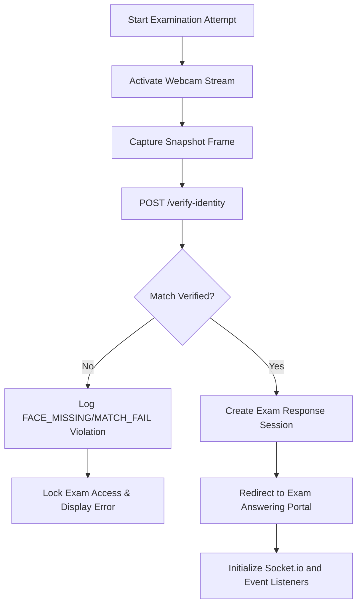

# System Architecture and Real-Time Proctoring Flow

This document details the system design, communication protocols, and processing pipelines of the **Smart Proctoring System for Online Exams (SPSOE)**.

---

## 1. Top-Level System Architecture

SPSOE is split into three decoupled, interacting modules:
1.  **Aegis Client (React Frontend)**: Runs in the candidate's browser, capturing camera frames, tracking window focus, rendering exams, and presenting admin controls.
2.  **Aegis API Server (Node.js/Express Backend)**: Manages authentication, database persistence, REST API resources, and orchestrates real-time events via Socket.io.
3.  **Aegis AI Proctor (Python Agent)**: Runs locally or as a microservice, consuming base64 frames over Socket.io, applying computer vision models, and feeding violations back to the server.

```
       +---------------------------------------+
       |             Aegis Client              |
       |  (React/TypeScript Browser Interface) |
       +-------------------+---------------+---+
                           |               ^
             HTTP REST API |               | Real-Time Socket Events
             (Auth, Exams) |               | (Frames, Alerts, warnings)
                           v               |
       +-------------------+---------------+---+
       |            Aegis API Server           |
       |     (Node.js / Express / Socket.io)   |
       +---------+-------------------+---------+
                 |                   |
    Mongoose ORM |                   | Socket Forwarding
                 v                   v
       +---------+---------+   +-----+---------+
       |      MongoDB      |   |  AI Proctor   |
       |  (Schemas, Logs)  |   | (Python Agent)|
       +-------------------+   +---------------+
```

---

## 2. Proctoring Verification Pipeline



### Identity and Liveness Verification
Before entry is granted, the student takes a webcam snapshot. This snapshot is verified against the profile image uploaded during registration:
*   The system compares facial features and landmarks.
*   Liveness indicators (e.g. tracking small facial changes over consecutive frames) prevent static photo presentation bypasses.

---

## 3. Real-Time Alert & Event Dispatching

During the exam, the system establishes a Socket.io bridge:
1.  **Frame Transmission**: Every 2 seconds, the client captures a compressed `160x120` frame from the camera stream, converts it to base64, and triggers `student_frame` event.
2.  **Server Routing**: The Node.js server receives the frame. If a Python AI proctor worker is online, it forwards the frame. If not, it executes a Node-side fallback simulation to ensure interactive logs are generated for testing.
3.  **Computer Vision Inference**: The Python AI-Proctor decodes the base64 frame:
    *   **Face Detection**: Runs a Haar Cascade face classifier. If no face is found (`FACE_MISSING`) or more than one face is found (`MULTIPLE_FACES`), a violation is registered.
    *   **Eye Gaze tracking**: Locates eyes, thresholds the iris region, and tracks off-center deviation. If a student repeatedly looks away, `EYE_LOOKING_AWAY` is flagged.
    *   **Head Pose**: Evaluates bounding box proportions and vertical alignment. Tilted or skewed face positioning registers `UNUSUAL_HEAD_POSE`.
    *   **Object Detection**: A lightweight MobileNet-SSD parses classes. Detection of laptops, phones (`tvmonitor`), or similar items flags `PROHIBITED_OBJECT`.
4.  **Alert Handling**: If a violation is caught:
    *   The Python agent overlays colored detection boxes and labels on the image.
    *   It converts it back to base64 and fires `ai_violation_result`.
    *   The server saves the log with the image evidence to MongoDB.
    *   The server broadcasts `admin_new_alert` to all active admins, playing a warnings chime.
    *   The server emits `proctor_warning` back to the student.

---

## 4. Screen visibility Lockdowns

To prevent tab switching:
*   The client listens to the HTML5 Page Visibility API (`visibilitychange` event) and window focus (`blur` event).
*   Switching tabs or minimizing the browser instantly fires a `screen_violation` event to Socket.io.
*   The server logs a `TAB_SWITCH` entry in the database, sends an alert to the admin, and issues a warning popup to the student.
